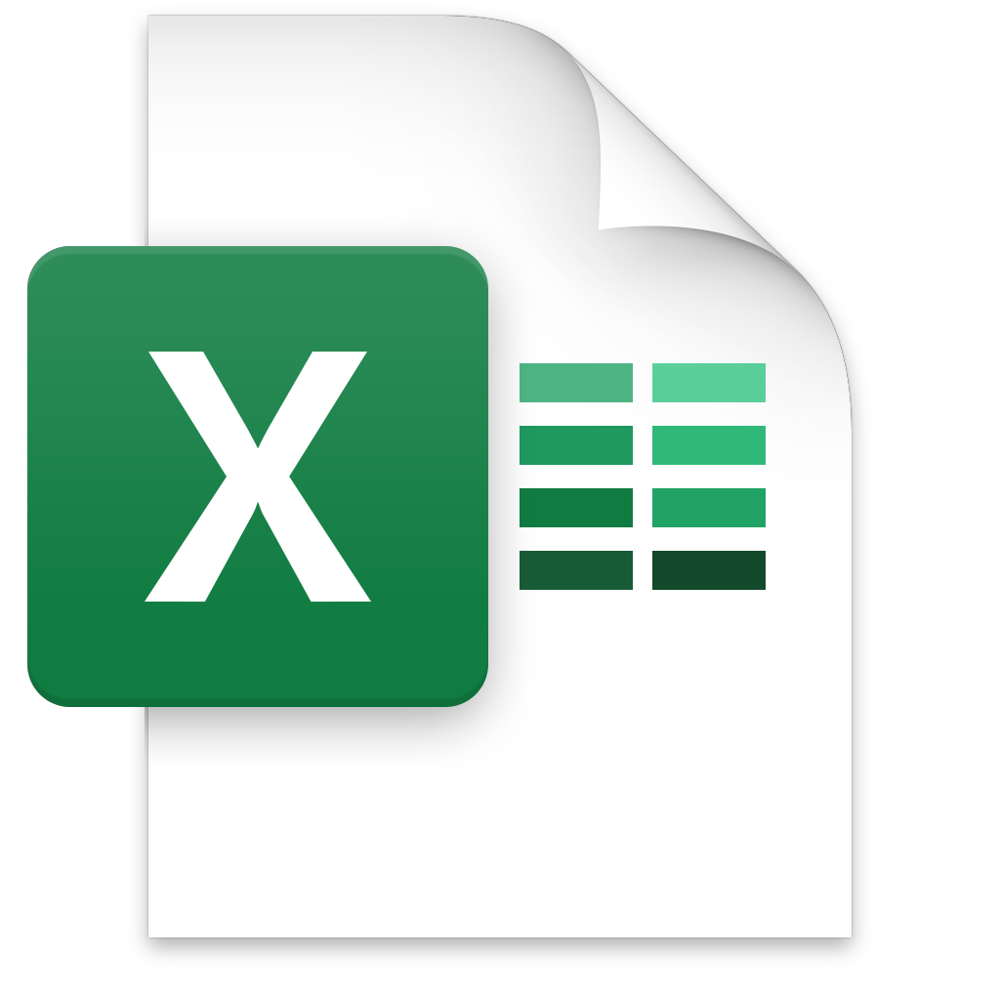

# Dissertation
*MA Music (Popular Music Research)*
**Goldsmiths, University of London**

## Data
(links to downloadable Excel files)

* News Article Database: [news-article_database.xlsx ](data/news-article_database.xlsx)
  * 9,841 news articles collected from music sites and mainstream media.

* Live Study Data: [live-study-data.xlsx ](data/live-study-data.xlsx)
  * manually collected in real-time by following identified artists on Twitter and Instagram.

* Google Trends: [google-trends.xlsx ](data/google-trends.xlsx)
  * collected for worldwide Google searches of identified artists.
    * Source: [Google Trends](https://trends.google.com/trends/)

* Billboard Chart Entries: [billboard_chart-entries.xlsx ](data/billboard_chart-entries.xlsx)
  * all Billboard chart entries for identified artists since 2016 on Hot 100 (songs) chart and Top 200 (albums) chart.
    * Source: [Billboard Hot 100 songs](https://www.billboard.com/charts/hot-100), [Billboard Top 200 albums](https://www.billboard.com/charts/billboard-200)

* RIAA Certifications: [riaa_certifications.xlsx ](data/riaa_certifications.xlsx)
  * all RIAA certifications for identified artists.
    * Source: [RIAA Gold & Platinum database](https://www.riaa.com/gold-platinum/)

## Interactive Figures

### Live Study
**Social Media Activity**

* [Live Study](figures/live-study/social-media-activity.html)

### Aggregate Attention Graphs
**Narrative Trends, Aggregate Attention, and Music Industry Charting Success**

These charts show the evolution over time of relevant news articles, Google search activity, and Billboard chart entries for each artist; annotated with major events.

* [6ix9ine](figures/aggregate-attention-graphs/6ix9ine.html)
* [A Boogie](figures/aggregate-attention-graphs/A-Boogie.html)
* [Juice WRLD](figures/aggregate-attention-graphs/Juice-WRLD.html)
* [Lil Peep](figures/aggregate-attention-graphs/Lil-Peep.html)
* [Lil Pump](figures/aggregate-attention-graphs/Lil-Pump.html)
* [Lil Skies](figures/aggregate-attention-graphs/Lil-Skies.html)
* [NBA YoungBoy](figures/aggregate-attention-graphs/NBA-YoungBoy.html)
* [Trippie Redd](figures/aggregate-attention-graphs/Trippie-Redd.html)
* [XXXTentacion](figures/aggregate-attention-graphs/XXXTentacion.html)

